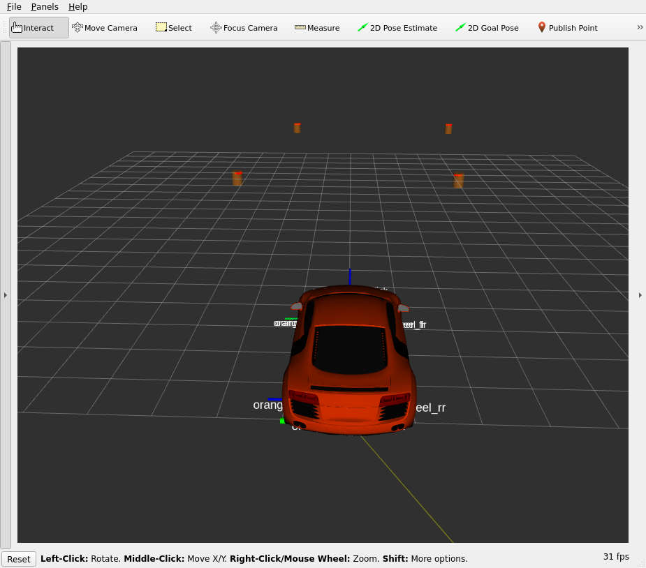

# autonomous-racing

## Dependancies
- Ubuntu 22.04
- ROS2 Humble
- pfms-support (Needs specific commit, follow below instructions)

## Simulation Dependancies
- Gazebo for ros2 humble
- Rviz2

## Installation
Install ros2 humble following this guide: https://docs.ros.org/en/humble/Installation.html 

Install gazebo:
```bash
sudo apt update
sudo apt install ros-humble-xacro ros-humble-gazebo-ros ros-humble-gazebo-plugins ros-humble-gazebo-msgs ros-humble-controller-manager ros-humble-rqt-robot-steering ros-humble-robot-localization ros-humble-gazebo-ros2-control ros-humble-joint-trajectory-controller ros-humble-joint-state-broadcaster ros-humble-diff-drive-controller ros-humble-imu-tools ros-humble-gazebo-ros-pkgs ros-humble-joint-state-publisher-gui ros-humble-joint-state-publisher 
sudo apt install python3-colcon-common-extensions
sudo apt install ros-dev-tools
```

Clone repo and download & install dependancies:
```bash
cd ~/ros2_ws/src
git clone https://github.com/Potatomastr27/autonomous-racing.git
cd ~/ros2_ws
sudo rosdep init
rosdep update
rosdep install --from-paths src --ignore-src -r -y
sudo apt install ./src/autonomous-racing/pipes/pipes_3.0.5-humble_amd64.deb
sudo ldconfig
```

Build packages:
```bash
cd ~/ros2_ws
colcon build --symlink-install
source ~/ros2_ws/install/setup.bash
```

## Using
Once installed you can run the control + simulator using:
```bash
ros2 launch autonomous-racing start.launch.py
```

Then once it's running you should see rviz come up with with a car like this:


Once you want it to start driving run the command:
```bash
ros2 service call /orange/mission std_srvs/srv/SetBool "{data: true}"
```